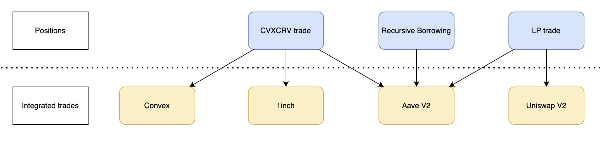

# defi-sdk

DeFi SDK is meant to abstract away most blockchain related operations. It is structured to separate each integration by category. To utilize DeFi SDK, we would have a position that can have can have multiple different trade components. Different positions can utilize these components in a different way but the trade components has the same functions no matter what kind of position they are part of. For example, Aave can be used in `cvxCRV trade` to borrow CRV, `LP trade` to borrow risky asset and `Recursive borrowing trade` to borrow and supply assets. 


## Current trade integrations
- Exhanges
    - Curve
    - Uniswap v2
- Lending platforms
    - Aave v2
    - Aave v3
- Staking
    - Convex
    - Quickswap LP


## Integrations
Integration likely falls under one of current main categories (exchange, lending, staking).
- Exhanges allow trading between assets and providing liquidity
- Lending protocols allow lending and borrowing
- Staking allows locking a token to earn rewards, staking is also used as "other" bucket because how staking is done varies quite a bit between different protocols

If a new integration does not fall under any of the categories, new category should be created. A category should include a generic implementation class that describes the form that integrations in the category should take and a separate file for each integration. 

A new integration should be a class that is named according to the integrated protocol. The integration should inherit the generic class of that category and include trade as one of it's properties. Generic class allows users who are not familiar with the inner workings to get a better error messages when they are calling methods that do not yet exist for that integration and the trade property provides a unified and tested way of doing standard operations. As a principle, when creating an integration with a protocol, only functionalities that are currently needed should be done. As an example, if only tracking data, no transaction integrations are needed at that point.

## Trade
The `DeFiTrade` class is a class that helps handling generic operations. It also keeps track of data that should not change across a single integration like user, there should be little reason for single trade to consist of 2 users but having a defined user helps in sending transactions, getting balances and so forth. Currently `DeFiTrade` handles the following:
- Sending transaction by abstracting away all required actions with Fireblocks
- Ensuring that required `Approval` is correct when spending tokens, check needs to be placed manually
- Getting current balances for any token and getting a `traded balance` which should not be 0

## Event reader
Event reader allows a multithreaded and consistent approach in reading arbitrary event data from blockchain. Currently supports multiple events, multiple addresses but lacks support for arguments.

## Util
Fairly self-explanatory. Most useful operations are connecting to different blockchains, getting contract ABIs, getting token spot price by address and sending alerts.


# Installation
## Installing as package
```sh
pip install git+ssh://git@github.com/dkacapitalmgnt/defi-sdk.git@main
```
## Google secrets
- Add secrets to google cloud secret manager
- Create and download JSON key file to computer
- export GOOGLE_APPLICATION_CREDENTIALS="path-to-file" (no quotes)
- more information: https://cloud.google.com/secret-manager/docs/reference/libraries#create-service-account-console

## Updating
- Run setup with following commands:
```sh
git clone git@github.com:dkacapitalmgnt/defi-sdk.git
python3 -m venv venv
. venv/bin/activate
pip install --upgrade pip
pip install pip-tools
pip-compile requirements.in
pip install -r requirements.txt
```
- Include new requirements to `requirements.in`
- Include them to `pyproject.toml` as well under "dependencies"
- Compile requirements.txt using `pip-compile requirements.in`